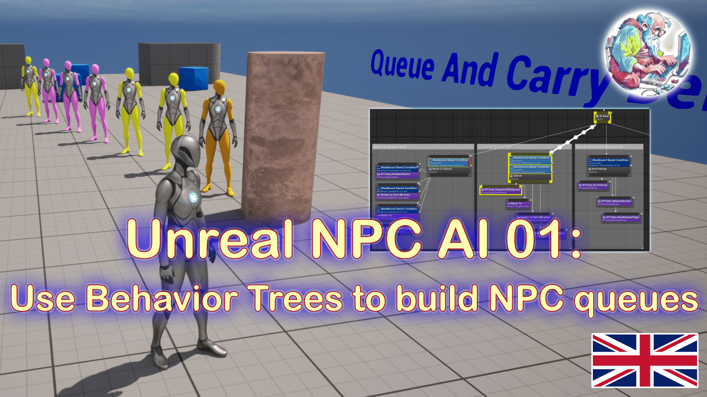

# Developer Bastian - NPC AI 01 #

## Demo of Unreal NPC behavior: BlackBoards, Behavior Trees, Queues ##

### Video tutorials ###
- [english version](https://youtu.be/UQgrfijfwsY)
- [german version](https://youtu.be/au5UQZdF0Qs)

### Website ###

more info at [https://developerbastian.tech/](https://developerbastian.tech/)

### New demo how to queue along a spine ###
I added another folder and map to the project called 'QueueAndRun'. If you open that, you will see a demo how to align the NPCs along a spine (done on request from some subscribers)

